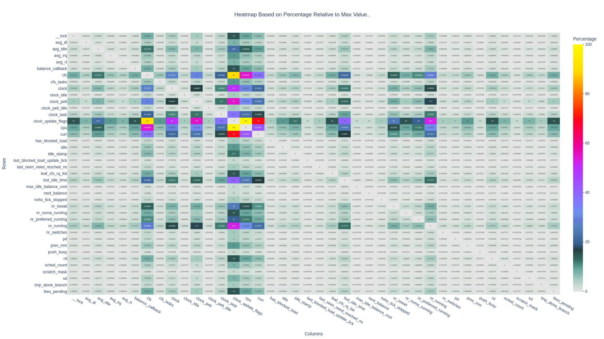

# kstruct-tuner

kstruct-tuner is a basic prototype kernel analysis tool that uses detailed access patterns of structure fields from trace data to generate heat maps and, through hierarchical clustering, suggests optimized field reorderings based on access affinity and spatial locality.

## Usage

Run the following commands from `src/` to parse traces, build the proximity graph, generate reordering insights, and produce the heatmap.

```bash
python3 struct-parser.py --exclude_cross_cpu ../logs/log.min ../logs/pahole ../logs/log.min.csv

python3 proximity-graph.py --method window --window_size 5 --n_jobs 10 --input_file ../logs/log.min.csv --output_file ../logs/log.graph.csv

python3 hierarchical-clustering.py ../logs/log.graph.csv -o ../logs/insights.out --json_out ../logs/insights.json --top_n 30 --per_field_top_k 5  # writes reordering insights in JSON

python3 gen-heatmap.py ../logs/log.graph.csv ../logs/heatmap.html
```

### Script Descriptions

1. **`struct-parser.py`**: Parses kernel trace logs and pahole structure analysis data
   - Takes raw trace logs (`log.min`) and pahole output (`pahole`) as input
   - Merges field access patterns with structure metadata (data types, offsets, sizes)
   - Optionally filters out cross-CPU accesses with `--exclude_cross_cpu`
   - Outputs structured CSV data (`log.min.csv`) with field access information

2. **`proximity-graph.py`**: Analyzes field access patterns to build proximity relationships
   - Uses a sliding window approach (`--method window`) to find fields accessed within a time window (`--window_size 5`)
   - Counts co-occurrences of field accesses to measure spatial/temporal locality
   - Processes data in parallel (`--n_jobs 10`) for performance
    - Generates an adjacency matrix (`log.graph.csv`) representing field proximity relationships

3. **`hierarchical-clustering.py`**: Performs clustering analysis for field reordering suggestions
   - **Input**: adjacency matrix CSV (`log.graph.csv`)
   - **Outputs**:
     - Text insights (`insights.out`) with reordered fields, clusters, top pairs, field strengths, inter-cluster links, and per-field top neary-by accesses.
     - Optional JSON (`--json_out insights.json`) mirroring the same insights and global graph stats
   - **Options**: `--top_n` to control how many top pairs and inter-cluster links are reported; `--per_field_top_k`:
   - Groups fields with high access affinity together using a greedy merge over strongest edges; provides actionable layout guidance

4. **`gen-heatmap.py`**: Creates visual heatmaps of field access patterns
   - **Input**: adjacency matrix CSV (`log.graph.csv`)
   - **Output**: interactive HTML heatmap file
   - Converts the adjacency matrix to percentage-based heatmap visualization
   - Generates interactive HTML heatmap showing field co-access patterns
   - Helps identify which fields are frequently accessed together

## Sample Heatmap


